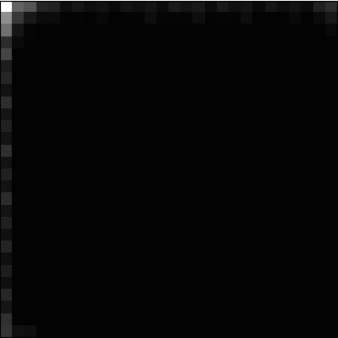

#  MNIST GAN implementation

**Context** : Second year project \
**Year** : 2020-2021

**Students** :

* Sarah Brood *sarah.brood@ecole.ensicaen.fr*
* Adrien David *adrien.david@ecole.ensicaen.fr*
* Kévin Pinson *kevin.pinson@ecole.ensicaen.fr* 

## What is this ?

A program build to create image of handwritten numbers, based on the MNIST database. \
This project has for goal to let us learn about generatives adversial networks. 

## Understand 

Good news we made a report about our implementation ! It is in french, in the directory "report". 


## Use this program
### Requirements
- Python 3.6 or higher 
- Tensorflow 2 : ``pip install tensorflow``
### Our program 
Only use ``` python3 gan.py```
### Results
You can find the produced images in the directory named "img"
The program is set to produce 4 images per epoch. 

### Our results 

You can find exemples of our differents results in the directory named "results".

Here is a gif of the evolution of one of the best results we got with this algorithm : 

#  


